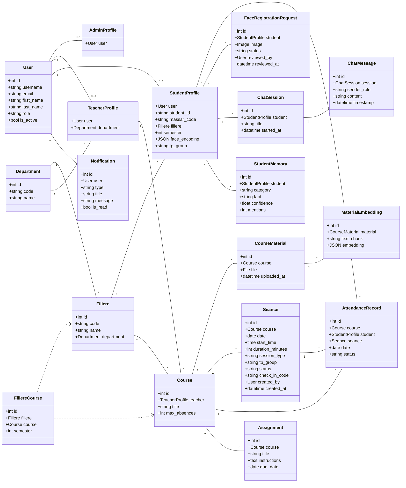

# CampusEye — Class Diagram

Domain model of the CampusEye platform (Django `attendance` app). Shows the core
entities, their key attributes, and relationships. Rendered with Mermaid.

## Enumerations
| Field | Values |
|---|---|
| `User.role` | STUDENT · TEACHER · ADMIN |
| `StudentProfile.tp_group`, `Seance.tp_group` | NONE · GROUP_A · GROUP_B |
| `Seance.session_type` | COURS · TP |
| `Seance.status` | SCHEDULED · ACTIVE · COMPLETED |
| `AttendanceRecord.status` | PRESENT · ABSENT · LATE |
| `FaceRegistrationRequest.status` | PENDING · APPROVED · REJECTED |

The `user` field on `AdminProfile` / `TeacherProfile` / `StudentProfile` is the
primary key (1‑to‑1 with `User`).

## Notes
- `User` is the single auth entity; the three profile tables (`AdminProfile`,
  `TeacherProfile`, `StudentProfile`) each have a 1‑to‑1 link to `User` via a
  shared primary key, modelling role-specific data.
- `FiliereCourse` is the association (join) entity for the many-to-many between
  `Filiere` and `Course`, carrying the `semester` attribute.
- `Seance.check_in_code` gates student check-in: students must enter it before
  face recognition runs. It is never exposed to students.
- `face_encoding` (on `StudentProfile`) stores the reference vector used by the
  face-recognition check-in.
