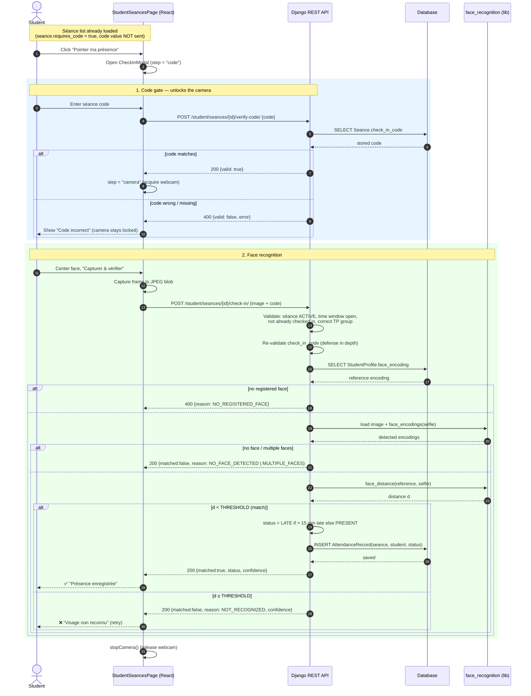

# Sequence Diagram — Student Check-in via Face Recognition (with Séance Code)

Flow for a student marking attendance: they must first enter the séance code
(given verbally by the teacher in class), which unlocks the camera; a selfie is
then matched against their registered face encoding.

## Key points
- **Code gate first.** The camera is not even acquired until `verify-code`
  succeeds. The code is never delivered to the student app — only a
  `requires_code` boolean is — so entering it proves physical presence.
- **Defense in depth.** The check-in endpoint re-validates the code alongside
  the image, so the gate can't be bypassed by calling check-in directly.
- **Recognition failures return HTTP 200** with `matched:false` + a `reason`
  code (`NO_FACE_DETECTED`, `MULTIPLE_FACES`, `NOT_RECOGNIZED`, …) so the UI can
  show a precise message; only hard errors use 4xx.
- **Status logic:** `PRESENT`, or `LATE` when the check-in is more than 15
  minutes after `start_time`.
