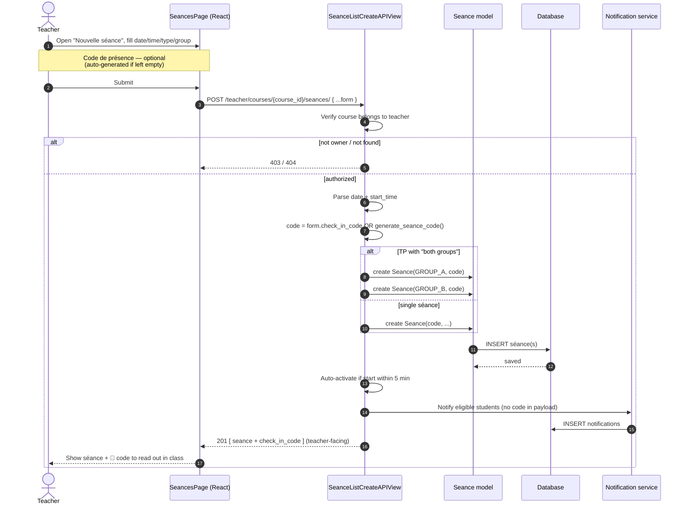
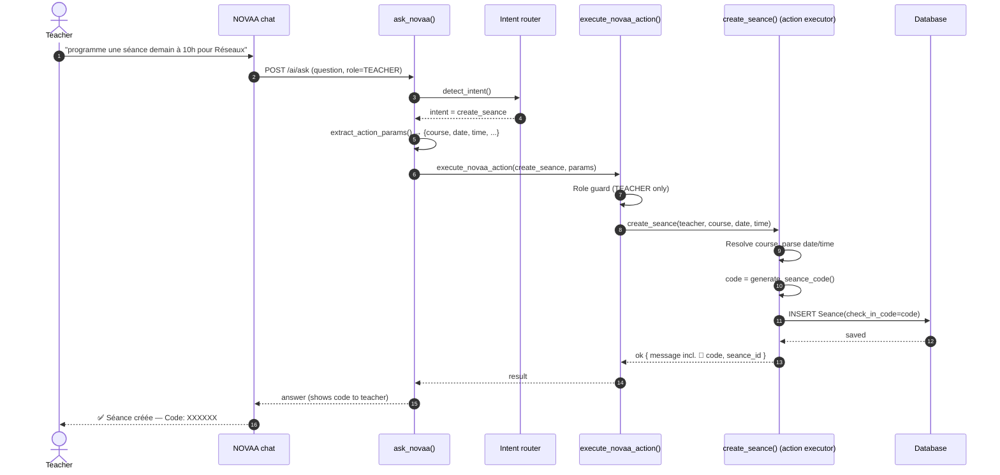

# Sequence Diagram — Séance Creation

A teacher schedules a séance. Two entry points are supported: the **manual form**
and a **natural-language command to NOVAA** (the AI assistant). Both auto-generate
a check-in code (or accept a teacher-supplied one) and notify students *without*
revealing the code.

## A. Manual creation (teacher form)

## B. Creation via NOVAA (natural language)

## Key points
- **Code source:** teacher-provided (uppercased) or `generate_seance_code()` — a
  6-char code from an unambiguous alphabet (no `0/O/1/I`).
- **TP "both groups"** creates two back-to-back séances sharing the same code.
- **Auto-activation:** a séance starting within 5 minutes is created already
  `ACTIVE` so check-in opens immediately.
- **Privacy:** the student notifications/serializers never include the code —
  only the teacher-facing responses carry `check_in_code`.
- **Online séances** (Google Meet) are created code-free, since a physical
  in-room code doesn't apply to remote attendance.
